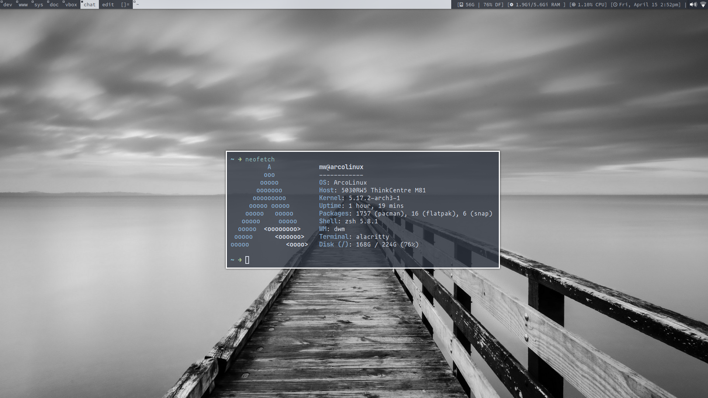

# dwm

my custom build of dwm

__note:__ to get the status bar to work copy the contents of .local/bin to ~/.local/bin in your home directory, and add it the the PATH with `export PATH=$HOME/.local/bin/:$PATH
`
